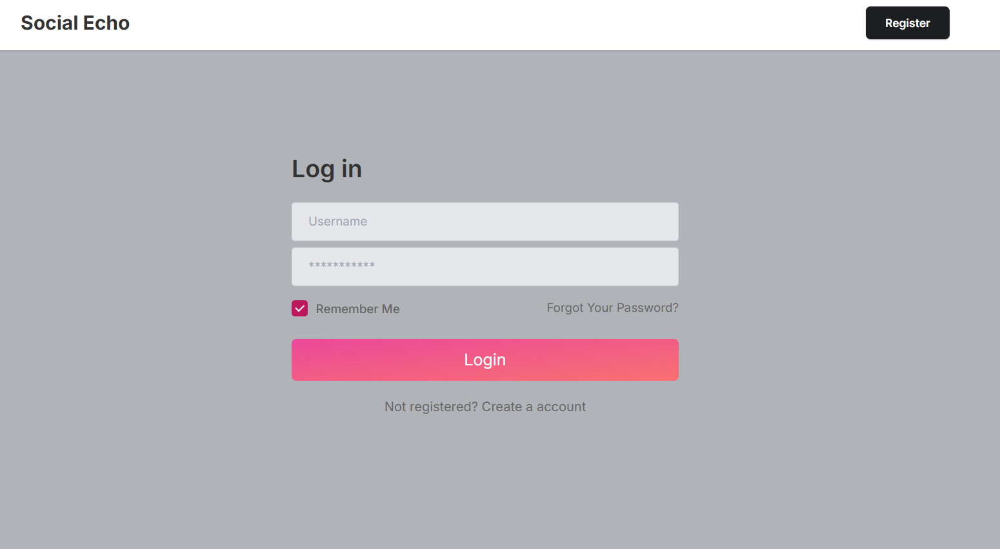
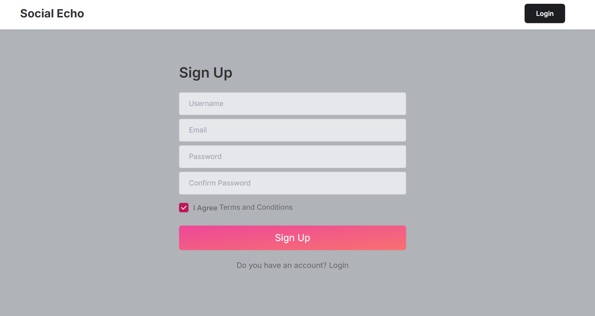
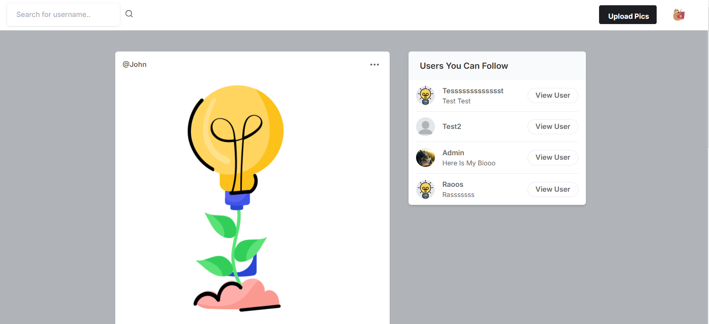
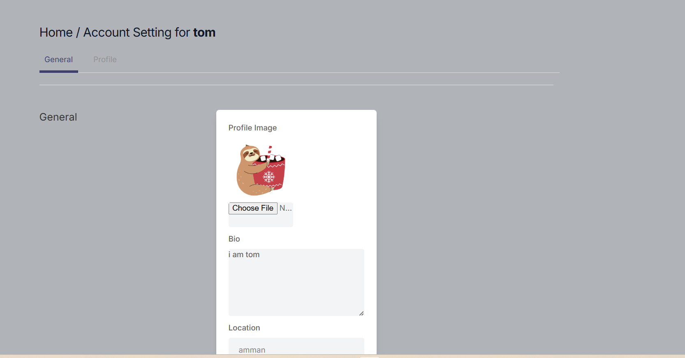
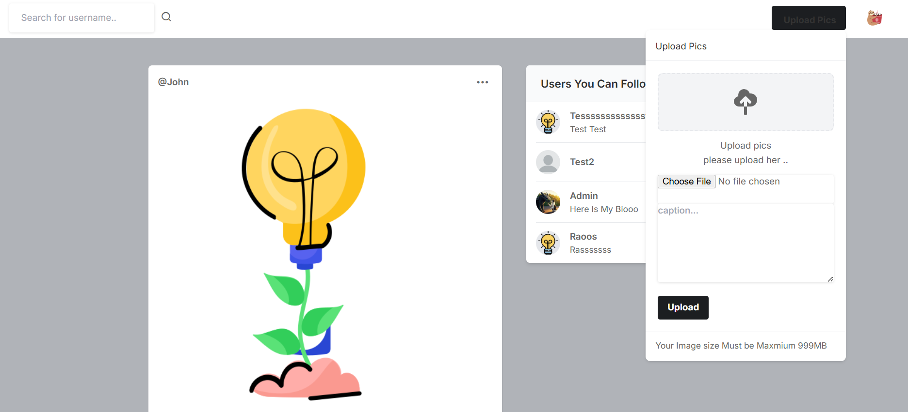
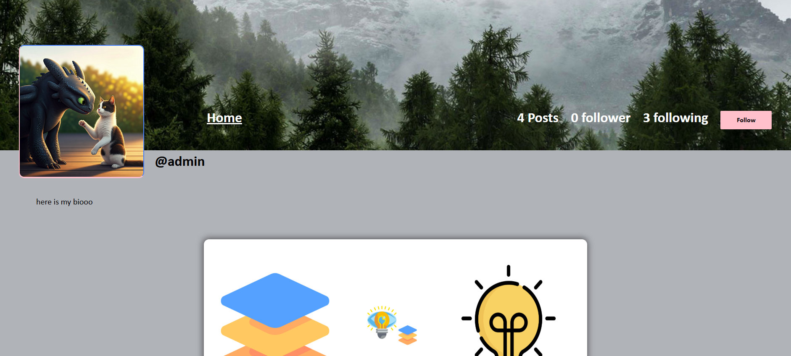

## 📢 Social Echo – A Social Media Platform Built with Django

### 🚀 Introduction

Social Echo is a feature-rich social media platform built using Django and Django Template Language (DTL). It enables users to connect, share posts, interact with others, and manage their profiles seamlessly.

### 📌 Features

✅ User Authentication – Signup, Signin, and Logout functionalities

✅ Profile Management – Users can edit account settings and update their profiles

✅ Post Creation – Users can upload and share posts with their followers

✅ Like System – Users can like and unlike posts

✅ Follow System – Users can follow and unfollow others

✅ Post Feed – A dynamic feed that updates with users' posts and interactions

✅ User Search – Search for users by their usernames

✅ User Suggestions – Personalized user recommendations

✅ Image Download – Users can download images from posts

✅ Responsive UI – Built with Django Templates (DTL) and static files management

### 🛠️ Tech Stack

Backend: Django (Python) 🐍

Frontend: Django Template Language (DTL) 🎨

Database: SQLite (default) / PostgreSQL (optional) 🗄️

Authentication: Django’s built-in authentication system 🔑

Static Files: CSS, JavaScript, and Images 📂

### 📦 Installation & Setup

1️⃣ Clone the Repository
```
git clone https://github.com/RoaaM/SocialEcho.git

cd social-echo
```

2️⃣ Create a Virtual Environment
```
python -m venv env

source env/bin/activate  # For macOS/Linux

env\Scripts\activate     # For Windows
```

3️⃣ Install Dependencies
```
pip install -r requirements.txt
```

4️⃣ Apply Migrations
```
python manage.py makemigrations

python manage.py migrate
```

5️⃣ Create a Superuser
```
python manage.py createsuperuser
```

6️⃣ Run the Server

python manage.py runserver

🔗 Open http://127.0.0.1:8000/ in your browser to access the application.


## 🖼️ Screenshots

### Sign In Page  


### Sign Up Page  


### Home Page  


### Account Settings  


### Upload Post  


### User Profile  



